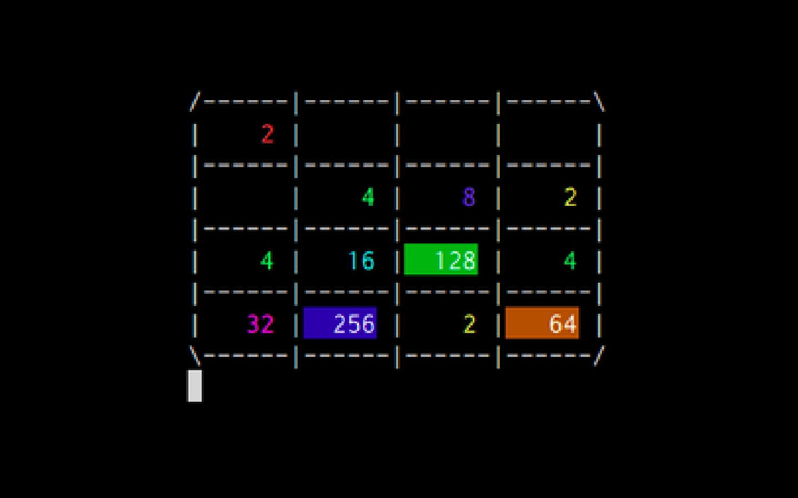

This project is a terminal imitation of the popular android game 2048. I wrote the code for this game using python in the 11th grade, for my Computer Science project. This game used modules like msvcrt and colorama along with clever substitutions to create a user-friendly gui.

Check out the game here: https://github.com/Sneha-shah/2048-game

###### Learnings:
As someone new to programming, I decided to write the logic and implement it myself. I later realised that the logic used was convoluted, and a lot of repetition could have been avoided with better structure and using object oriented programming. I also learnt how difficult it can be to make changes to an undocumented and unstructured code. This is a consideration I have kept in mind for later projects. 

