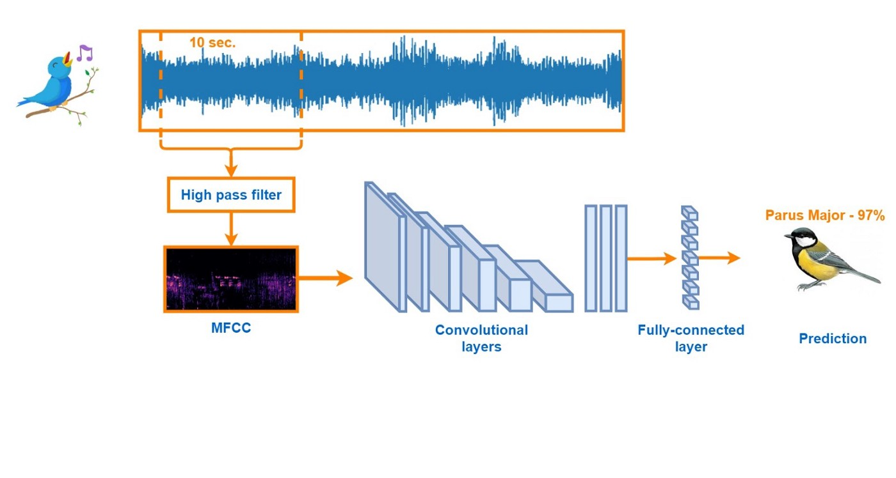

#### Automatic Classification of Bird Calls 
**Project under [Dr. Sarang C Dhongdi](https://www.bits-pilani.ac.in/goa/sarang/profile) Jan 2019 – May 2019**
- Studied algorithms that use signal processing techniques to identify bird species from their calls or songs, and learnt about transforms like the mel frequency cepstral coefficients.
- Implemented machine learning algorithms for the same using python. Learnt about convolutional neural networks and compared results with traditional algorithms using only signal processing methods.

#### Voice Scrambler and Unscrambler 
**As Part of ’Digital Signal Processing’ Course Aug 2018 – Dec 2018**
- Designed a system that scrambles and unscrambles voice signal for safe, loss­less transmission. The process primarily involved modulation with a key frequency, and included 2 low pass filters.
- The model was first tested on MATLAB and finally implemented on TI 6748 DSP kit. It was tested on recorded as well as real­time audio data.
- Correlation between original and scrambled signal was found to be 0.05, while correlation between original and unscrambled signal was found to be 0.98.
- Checkout the project report [here](https://drive.google.com/file/d/0B28lYNZMvTvwajMwZ1ZaQVEyWVk5V3R6NUFTcVBFYlZlRjJv/view?usp=sharing&resourcekey=0-YXihl6qDrb5-cPhKqOABcQ)

