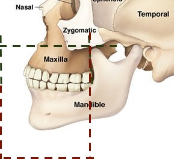

This project was done as part of a research on volume expansion of a jaw after using arch expansion treatment. Worked with Doctor Pooja Radhakrishnan (add link) to identify the volume of a jaw from a 3D medical scan.

**Stage 0:** 
The initial plan was to manually mark edge points of jaw and calculate volume of the trapezoidal shape formed. However, this has large scope for manual error, and so other options had to be considered.

**Stage 1:** The first step in order to find the volume using MATLAB, was to separate the bone from the soft tissue in the CBCT scan. In this scan, the intensity value for each voxel is proportional to the density of the area being scanned. The bone has a higher intensity than soft tissue in the image. Therefore, I separated the bone by deciding a fixed intensity threshold. I later realised that a fixed threshold was not very accurate, and so changed it then.

**Stage 2:** The next step was to separate the jaw from the rest of the image. I tried multiple approaches; using segmentation algorithms, using the teeth as reference for the jaws, and slicing the image at fixed points. Uassing betweeltimately, the last one showed best results and so we used that. the upper jaw (Maxilla) was bounded on top by the nasal canal, and at the back by the bone of the lower jaw. The lower jaw (Mandible) was bounded at the back at the point where the upper end of the lower jaw began. The maxilla and mandible were separate by a plane p 

**Stage 3:** Finding volume by adding voxels set to 1 

**Stage 4:** Getting the post scan and realising volume difference is very erratic

**Stage 5:** Registration of pre and post images (still inaccurate)

**Stage 6:** Using varying threshold instead of fixed threshold (Professor Rajnikanth?) (still inaccurate)

**Stage 7:** Using GLCM texture analysis to find volume of bone (Prof idea) (ongoing)

