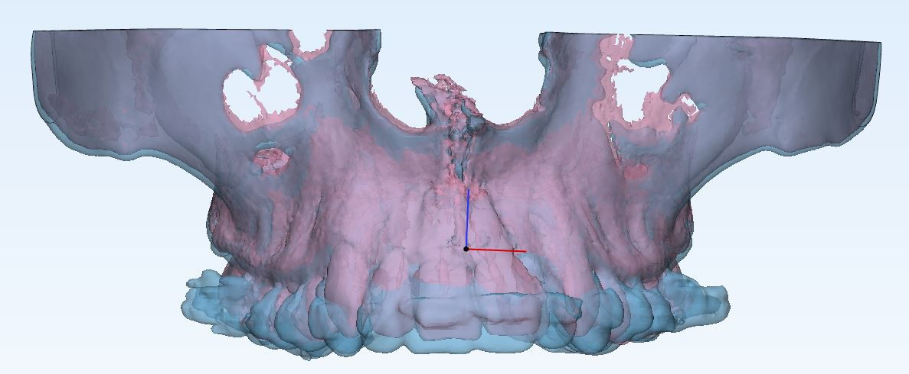

This project was done as part of a research on volume expansion of a jaw after using arch expansion treatment. Worked with Doctor Pooja Radhakrishnan (add link) to identify the volume of a jaw from a 3D medical scan.

**Stage 0:** Initial plan was to manually mark edge points of jaw and calculate volume of the trapezoidal shape formed

**Stage 1:** Thresholding to find bone

**Stage 2:** Segmenting jaw section

**Stage 3:** Finding volume by adding voxels set to 1 

**Stage 4:** Getting the post scan and realising volume difference is very erratic

**Stage 5:** Registration of pre and post images (still inaccurate)

**Stage 6:** Using varying threshold instead of fixed threshold (Professor Rajnikanth?) (still inaccurate)

**Stage 7:** Using GLCM texture analysis to find volume of bone (Prof idea) (ongoing)

.

.

.

.

.

.

.

.

.

.

.

.

.

.

.

.

.

.

.

.

.

.

.

- Methods used, registration, segmentation, thresholding, GLCM
- Software (MATLAB)
- Motivation
- Learnings, idealistic approach, difficulty without a guide, slow progress, engaging and fascinating, 
- Mention paper? thesis?
- Add some screenshots pls
- Add a video of me talking about this project?
- Share code on GitHub
- 
