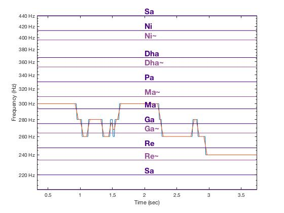

Using signal processing techniques to create an application to generate a real time pointer of the note (wrt Hindustani classical nomenclature) a person is singing, and a similar identification for a recorded song.
Current model generates a rough graph which is accurate only for notes held longer. Working on accuracy of the identification by using different window types and sizes.
Long term aim is to create a mobile application that helps beginner singers identify the accuracy of the note they are currently singing.

