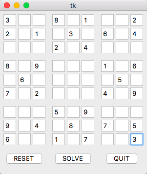
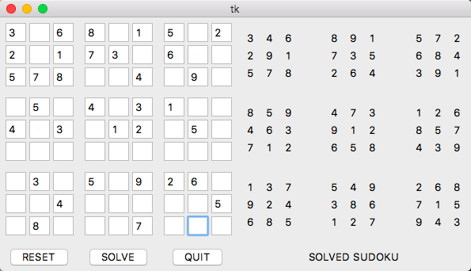
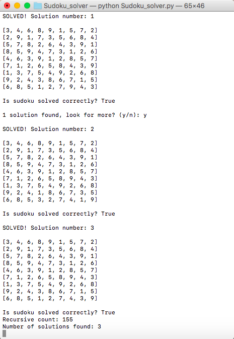

Used python and tkinter to create a GUI sudoku solver that combines manual and backtracking approaches for quicker solving.
Currently, users have to manually enter given values in the sudoku, and so I am working on using computer vision to identify numbers from a written/printed sudoku using a camera.

Checkout project on GitHub: https://github.com/Sneha-shah/sudoku-solver

#### Approach
###### Manual Approach: 
This solves the sudoku using methods similar to human solving. It checks every column, row, then box for missing numbers and fills it in if there is only one possible option. It failes for difficult sudokus that would require guessing by the solver.

###### Backtracking Approach: 
This is a recursive approach to solve a sudoku. It guesses a number for each box and checks at every point if the rules are broken; if so, it backtracks and tries a different number. It is more thorough in the solving process and also identifies if there are multiple possible solutions. However, the time taken for this approach can be quite large.

###### Combined Approach: 
In this program, a combined approach is taken where it solves the sudoku to the maximum possible point with the manual approach. When no more numbers can be added, it shifts to the backtracking approach. This ensures that the solving process takes less time than a purely backtracking approach.

**The program has an option to solve sudoku using any one of the above approaches.**

**Terminal interaction can be used to find multiple solutions. At the end of every solution found the recursive count and number of solutions found are displayed on the terminal.**

