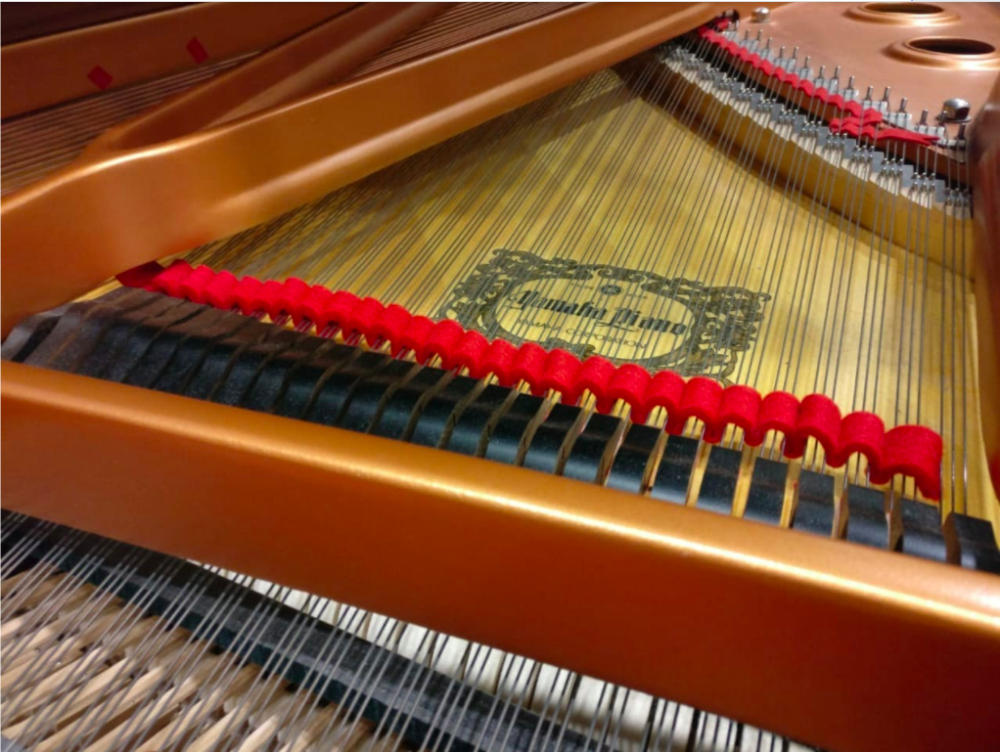

Piano tuning is known to be difficult because the stiffness of piano strings causes the tones produced to be inharmonic. Aural tuning is time consuming and requires the help of a professional. This motivates the question of whether this process can be automated. Attempts at automatic tuning are usually assessed by comparing the Railsback curve of the results with the curve of a professional tuner. 

In this project we determined a simple and reliable rule for tuning the high tones of a piano with the help of a listening test. This rule consists of matching the two tones in an octave interval so that the first partial frequency of the upper tone becomes exactly the same as the second partial frequency of the lower tone. This rule was rated best among four tuning rules that were compared in the test. 

The results found are explained using a beat-based analysis, and are consistent with some previous studies. They are also tested against the existing method of using Railsback curves, and it is shown that comparison using Railsback curves is an unreliable method of assessing different tunings. The findings from this paper can be used to create a complete automatic tuner that could make the process of piano tuning quick and inexpensive.

**For a detailed description of the work done, check out my [Bachelor's thesis](https://drive.google.com/file/d/1qywKK0RzuviFrgbEMc5MW3J3WBfjocU_/view?usp=sharing).**

**You can find the paper published on this work [here](https://www.researchgate.net/publication/339995979_Automatic_Tuning_of_High_Piano_Tones).**

### Ways to tune a piano
##### Professional Tuner (Aural tuning)
* This method has been used for centuries, and the art has been perfected over the years
* The complexity of the task means it cannot be done by a layman or even a musician not trained in the field
##### Computers (Automatic tuning)
* This is a fairly new idea, which has not been explored to its full potential yet
* Current devices deliver unsatisfactory results and are not widely in use

### Why is tuning a piano so difficult?
Apart from the regular challenges of deciding what intervals to prioritise while tuning an instrument, the piano offers its own challenges.
* Piano strings are inharmonic; the partials of a tone are not exact multiples of the fundamental
* This means that target fundamental frequency of each tone is not fixed
* The strings get detuned with time, and so need to be tuned regularly

### The method of aural tuning
The tuning is based on the equal temperament scale. The process involves listening to different intervals on the piano and counting the beats produced. The target is to minimise the beats, which is done via the a specific process.
##### The process
**1. Reference note is tuned to some frequency**
* usually A4 tuned to 440 Hz
* concert pitches are often 442 or 443 Hz 

**2. Reference octave is tuned using this note**
* uses many intervals starting from reference note
* octave is near the middle of piano
* used to tune rest of the piano
(Add picture of reference octave here)

**3. Upper half of the piano tuned using reference octave**
* octaves used to tune
* also sometimes use other tests 

**4. Lower half of the piano tuned using reference octave**
* Uses octaves and some larger intervals
(Add picture of higher and lower octaves here)

###### Challenges of aural tuning
* Time consuming and expensive
* Requires a professional or years of training

### Automatic Tuning
##### Steps
* Input: Recorded untuned piano tones
* Intermediate: New fundamental frequencies of tones
* Output: Amount to turn tuning pin for tuned tones
* Action: Turning the tuning pin
##### Main challenge
Finding new fundamental frequency
Imitating results of aural tuning
##### What makes it hard
Inharmonicity of piano strings
Subjectivity in aural tuning

### Shortcomings of previous studies
##### Quality of tuning compared with professional tuner
* Visually using Railsback curves
* Calculating deviation of fundamental frequencies
##### Drawbacks
* Subjectivity of professional tuning
* Compounding effect of tuning mistakes
* Not backed by any listening tests 

### Contribution
##### 1. High Frequency Tones
All analysis and results are for high piano tones
Properties	
* Have very high inharmonicity
* Few significant partials
* Fast decay
* Resonance in recording due to absence of damping
* Tuned using octaves
##### 2. New Evaluation Method
Beats based analysis 
Analyse beating effects for each octave
Advantages
* Close to what professional tuners do
* Correlates with listening study 
##### 3. New Set of Recordings of Tuned Piano Tones
Tones recorded on a Yamaha Disklavier
##### 4. Listening Study
To find a simple tuning rule for high tones
Compare different tuning analyses with results
4 tuning rules tested near 6th octave
Multi Stimuli test with anchor
16 participants 
( Add audio samples here)

### Results
###### Methods:
1.  Professional tuning (n)
2. Geometric mean rule (gm)
3. Matching first set of partials (m1)
4. Matching second set of partials (m2)
5. Matching third set of partials (m3)

(Add image)

### Conclusion
* Found simple rule for tuning high partials: Amongst the rules tested, matching the first set of partials scored the highest points in the listening test. 
* Proposed new method to evaluate tuning: Proposed a beat-based approach that tries to mimic aural tuning, the results of which were confirmed by the listening test

